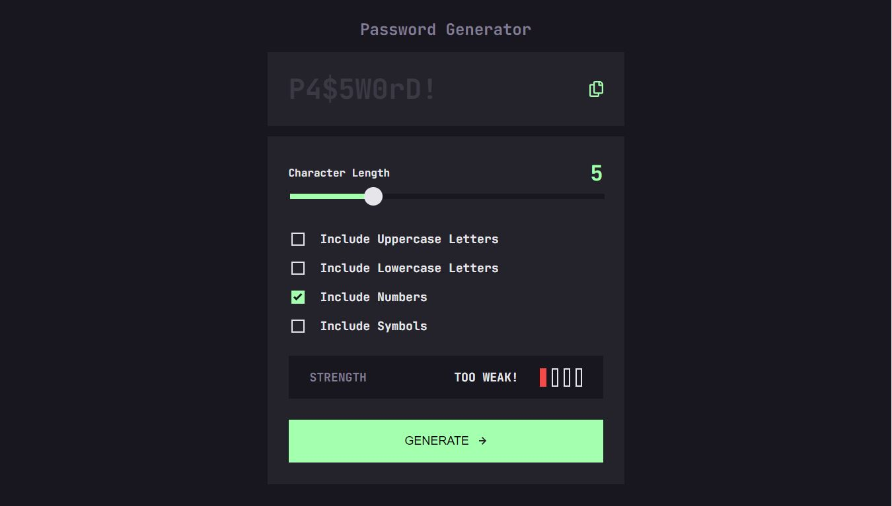

# Frontend Mentor - Password generator app solution

This project is a solution to the [Password generator app challenge on Frontend Mentor](https://www.frontendmentor.io/challenges/password-generator-app-Mr8CLycqjh).

## Table of contents

- [Overview](#overview)
  - [The challenge](#the-challenge)
  - [Screenshot](#screenshot)
- [My process](#my-process)
  - [Built with](#built-with)
  - [What I learned](#what-i-learned)
  - [Useful resources](#useful-resources)
- [Author](#author)

## Overview

### The challenge

Users should be able to:

- Generate a password based on the selected inclusion options
- Copy the generated password to the computer's clipboard
- See a strength rating for their generated password
- View the optimal layout for the interface depending on their device's screen size
- See hover and focus states for all interactive elements on the page

### Screenshot

## My process

### Built with

- Semantic HTML5 markup
- CSS custom properties
- Flexbox
- Mobile-first workflow
- JavaScript

### What I learned

- how to work with svg files 
- how to change HTML content via JavaScript
- basics of JavaScript like for loop, If statements, functions, DOM, event listeners

### Useful resources

- [Css color filter generator](https://angel-rs.github.io/css-color-filter-generator/) - This helped me with change   color of svg icon because I couldn´t change it via color property.

## Author

- GitHub - [Marek Vcelak](https://github.com/VcelakMarek)